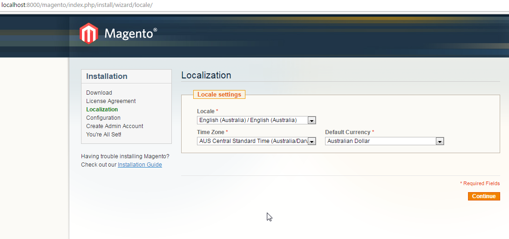

# magento-dev
## a vagrant environment for magento 1.9 development

### dependencies
- box-cutter/ubuntu1404-desktop

> IMPORTANT: If you have a corporate proxy - ensure your shell has a HTTP_PROXY environment variable set BEFORE vagrant up

```
cd magento-1.9
vagrant up
```

> NB: You'll probably see a fair bit of red: Composer pokes most of its output to STDERR and can be safely ignored

### Magento setup

Once done, you should be able browse to http://localhost:8000/magento/ from your local machine to begin configuring your instance. You are now ready to configure the last few settings to complete your installation.

#### 1. Localize your instance 



#### 2. Configure MySQL


#### 3. Configure Web access options


#### 4. Finalize admin login information


#### Ports
* host 8000 : guest 8000 - apache2
* host 3306 : guest 3307 - mysql

#### Drive mappings
Vagrant will map the following drives:

./magento to [guest]:/var/www/html/magento

### Plugin development
Once provisioned you should be able to browse to ./magento/app/code on your host and begin adding plugin related code files. You may need to either turn off magento's cache, or periodically flush it in order to see changes occur, but for the most part you can simply trust development done on the host will be picked up by the magento instance on the guest.

#### Debugging

This image is configured with XDebug turned ON, to take advantage of this, use Chrome's xdebug extension and an IDE that can interpret XDebug messages


